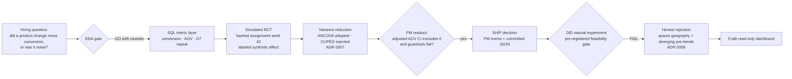
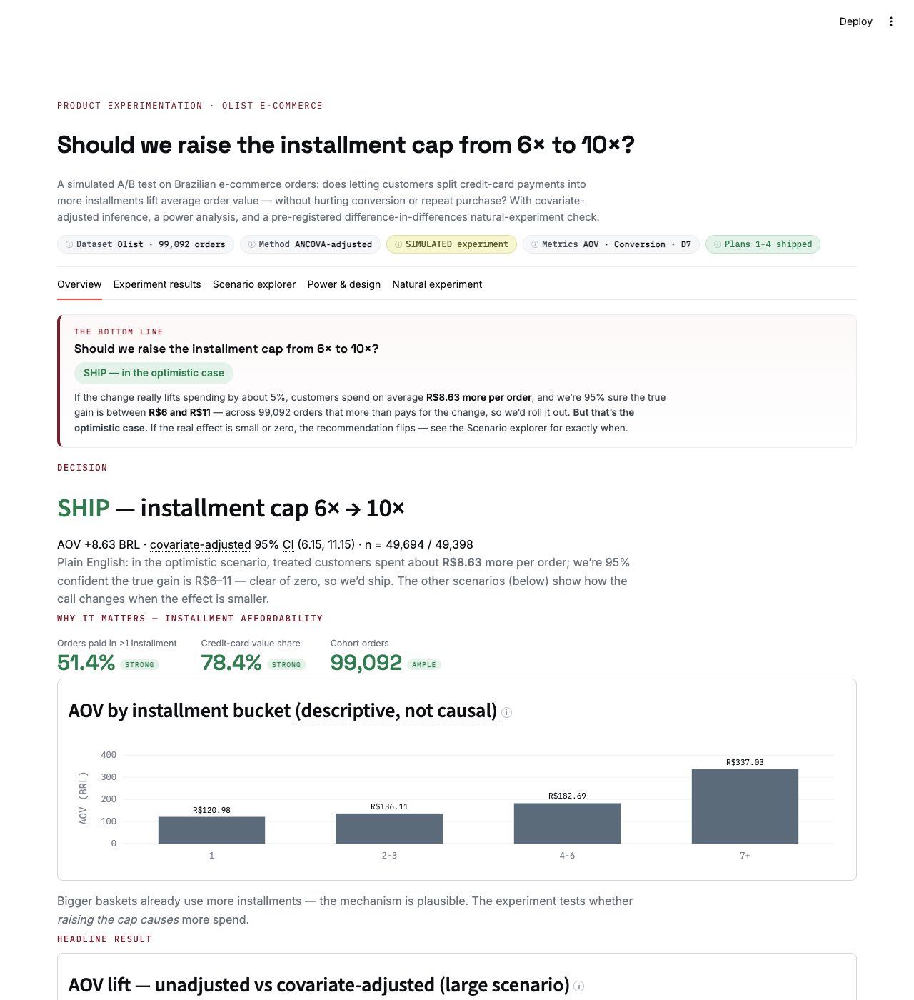
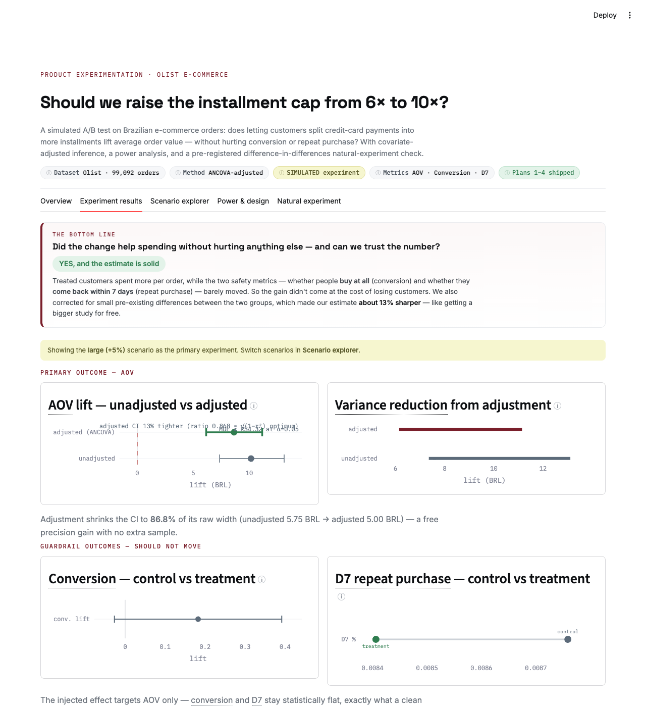
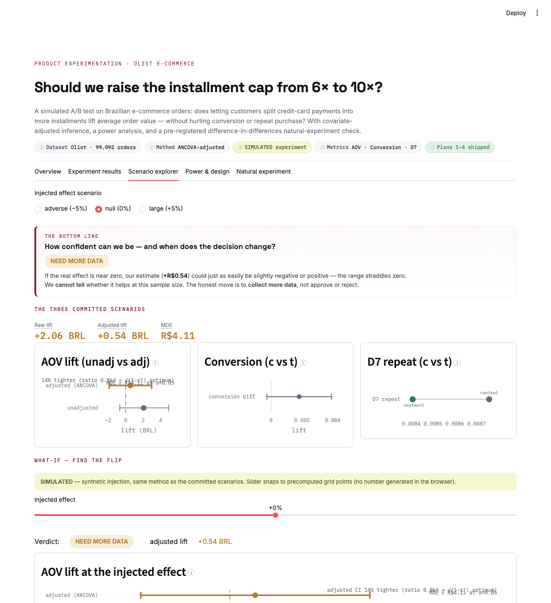
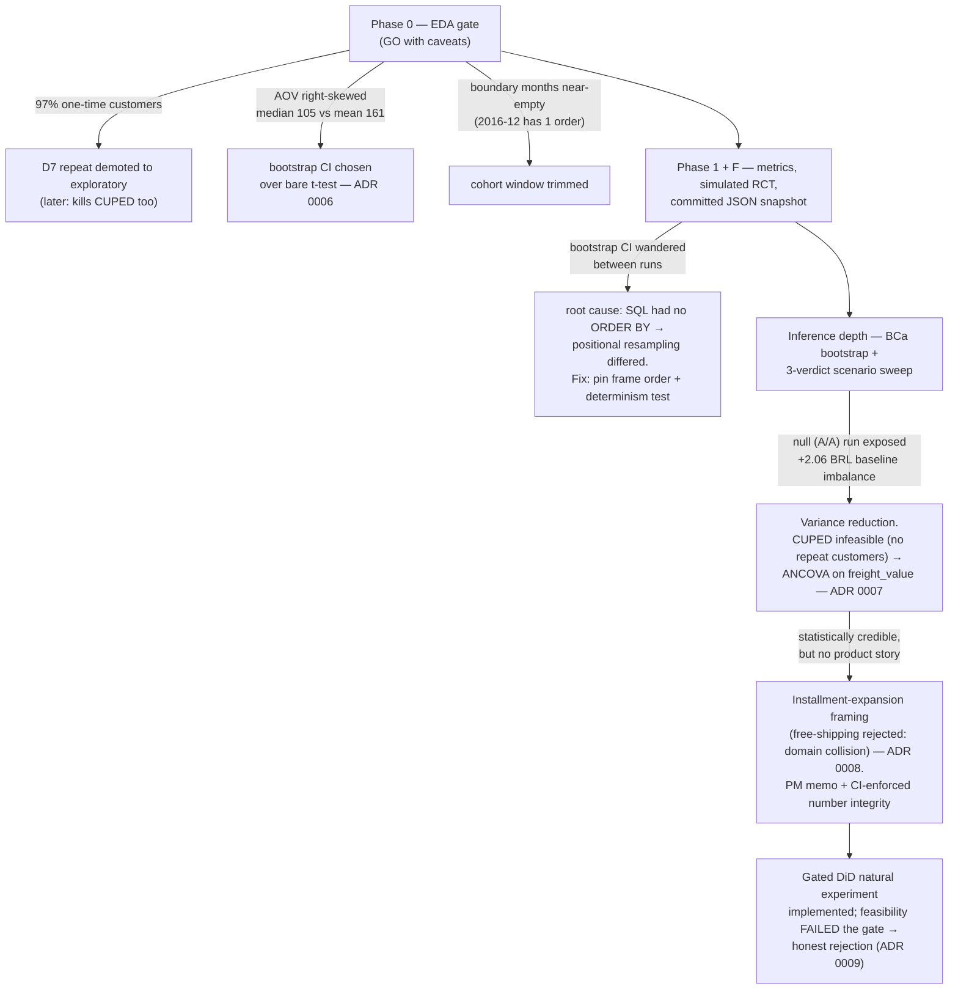
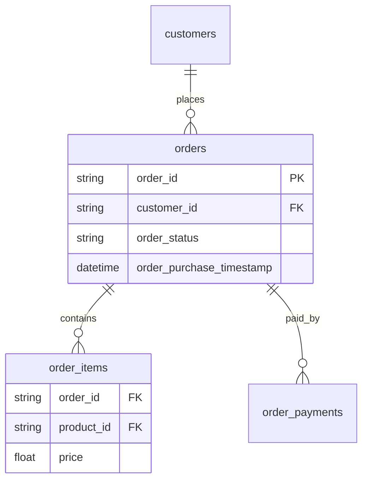
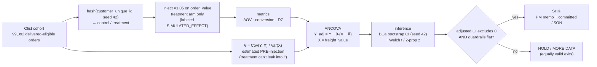
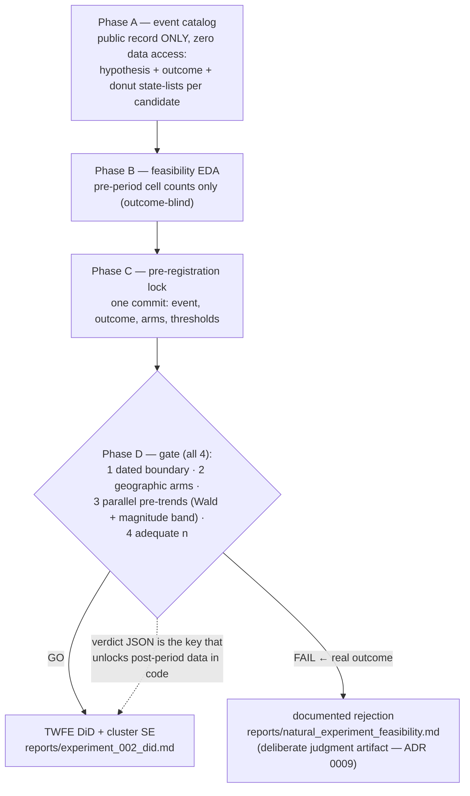

# Product Experimentation & Growth Metrics Platform

**Status:** live [Streamlit dashboard](https://product-experimentation-analytics.streamlit.app/) ·
208 tests · 95.6% coverage · all CI green

> **Simulated RCT on historical Olist cohorts.** Variants are assigned by hashed
> `customer_unique_id` (seed 42) on historical data — Olist has no native A/B column.
> The treatment effect is a synthetic constant (`SIMULATED_EFFECT = 0.05`, defined once in
> `src/constants.py`) injected after assignment to demonstrate the inference pipeline.
> This is not a real product lift. Seed 42 is documented and pinned.

End-to-end **product analytics** for a classic hiring question: *Did a product change actually improve conversion, or was it noise?* Built on the [Olist Brazilian E-Commerce](https://www.kaggle.com/datasets/olistbr/brazilian-ecommerce) dataset — SQL metric definitions, simulated experiment analysis, confidence intervals, and a ship/no-ship recommendation.

[](https://www.python.org/downloads/)
[](https://product-experimentation-analytics.streamlit.app/)
[](./tests/)
[](./tests/)

> **Disclaimer:** Experiments in this repo are **simulated** on historical Olist data (hashed customer assignment or documented natural experiment). This is not employer A/B test data and does not claim causal lift from a real product rollout.

---

## The project journey

The end-to-end arc, with a decision in both directions: a SHIP call on the simulated RCT and an honest rejection of the natural experiment at its pre-registered gate.



---

## Dashboard

A read-only **Streamlit + Plotly** dashboard renders the committed `reports/*.json`
and `reports/experiment_grid.json` — no recompute at runtime; every number is traceable to a
committed report or a labeled analytical formula. Five tabs:

| Tab | What it shows |
|-----|---------------|
| **Overview** | Plain-language verdict tile, key metric summary with semantic color-coding (good / average / poor), and the business motivation for the installment-expansion test |
| **Experiment results** | Dumbbell CI chart (raw vs ANCOVA-adjusted), range/variance plot, split bar for conversion, diverging-marker guardrail chart — all with layered ⓘ how-to-read hovers and glossary term spans |
| **Scenario explorer** | Verdict-flip across adverse / null / base / large injected effects + **What-if effect grid** (21 grid points; `reports/experiment_grid.json`) — lift forest + MDE-vs-n heat map controlled by a slider |
| **Power & design** | Analytical MDE calculator (`src.experiment.power`) with power-vs-effect curve; labeled **CALCULATOR** banner; no experiment data involved |
| **Natural experiment** | Gated DiD honest rejection — pre-trends coefficient plot, 2 leads breaking the band highlighted red, gate checklist with FAIL badges |

**Design principles:** persistent header with chip rationale tooltips; plain-language bottom-line
takeaway tiles per tab; self-explaining chart ⓘ hovers; semantic value color-coding; de-AI theme
(white · Space Grotesk · Inter · IBM Plex Mono · oxblood accent). Loud **SIMULATED** and
**CALCULATOR** banners on every synthetic figure. Verdict always read from `recommend()` in the
committed report — never recomputed.





[Open the live dashboard ↗](https://product-experimentation-analytics.streamlit.app/) &nbsp;·&nbsp; Redeploy or fork: **[docs/DEPLOY.md](docs/DEPLOY.md)**

Run locally:

```bash
pip install -e ".[dashboard]"
make dashboard        # streamlit run dashboard/app.py
make experiment-grid  # rebuild reports/experiment_grid.json (requires full Olist)
```

---

## The business problem

A product team ships a checkout or onboarding change. Leadership asks:

1. Did **conversion** move beyond random noise?
2. Are **AOV** and **repeat purchase** consistent with the story?
3. Was the test **powered** enough to detect a meaningful effect?
4. Should we **ship**, **hold**, or **collect more data**?

Most ML portfolio projects prove modeling depth. This one proves metric definitions, statistics, and product judgment — the experimentation, causal framing, and SQL case-study skills product DS interviews test.

---

## Results — Experiment 001 (simulated)

**Framing:** installment-expansion test — would raising the interest-free installment cap
(6x → 10x) grow basket sizes? Motivated by real Olist payment behavior
([motivation stats](reports/installment_motivation.md)); effect itself is simulated and labeled.
**→ Read the [PM decision memo](reports/experiment_001_readout.md)** — the headline artifact:
verdict, guardrail readout, caveats, rollout + monitoring plan.

> Full report: [`reports/experiment_001.md`](./reports/experiment_001.md). Numbers below are
> emitted by `make experiment` on the real Olist cohort (99,092 delivered-eligible orders);
> nothing here is hand-entered. The lift is a **labeled synthetic effect** (`SIMULATED_EFFECT = 0.05`),
> not a real product rollout.

| Metric | Control | Treatment | Lift | 95% CI | p | Verdict |
|--------|---------|-----------|------|--------|---|---------|
| **AOV, ANCOVA-adjusted** (decision object) | 160.64 | 169.27 | **+8.63** | (6.15, 11.15) | — | CI excludes 0 → **SHIP** |
| AOV, raw (audit) | 159.88 | 170.03 | +10.15 | (7.36, 13.11) | <0.0001 | reported alongside |
| **Conversion** (guardrail) | 0.9700 | 0.9718 | +0.0018 | (−0.0003, 0.0039) | 0.087 | CI spans 0 → no harm |
| **D7 repeat** (exploratory) | 0.0088 | 0.0084 | — | — | — | descriptive only |

**Recommendation: SHIP** — the **adjusted** AOV 95% CI lies entirely above zero (since the
covariate-adjustment pass /
[ADR 0007](docs/adr/0007-covariate-adjustment-not-cuped.md), verdicts are decided on the
ANCOVA-adjusted CI; raw numbers are always reported for audit). The conversion guardrail shows
no significant movement (the synthetic effect was injected on `order_value` only, so the
guardrail *should* stay flat — and it does, validating no leakage).

**Reading the numbers (the narrative that matters in interviews):**

1. **Why is raw lift +10.15 when the injected effect should add ~8.1?** Random hash assignment
   left the treatment arm with a slightly higher pre-effect baseline (~161.9 vs 159.9). The ×1.05
   multiplier adds ~8.1; the ~2.0 baseline gap is sampling noise. The ANCOVA adjustment
   pulls that imbalance back out: adjusted lift **+8.63** lands near the known truth — the
   adjustment demonstrably corrects the bias, which is the whole point of having injected a
   known effect. Decompose before you trust a lift.
2. **The guardrail is the integrity check.** Effect touches only `order_value`; `order_status`
   is untouched, so conversion staying flat (p=0.087) is *expected* and confirms the pipeline
   doesn't leak the treatment signal into other metrics.
3. **Powered enough?** AOV MDE ≈ 4.32 at n≈49k/arm — the detected +10.15 is well above the
   minimum detectable effect, so the SHIP call isn't an underpowered fluke.
4. **Assignment balance:** 49,694 control / 49,398 treatment (0.6% gap, within the 5% tolerance
   guard). A near-50/50 split confirms hash assignment introduces no structural bias.
5. **Reproducibility finding (Phase F).** The bootstrap CI was initially *non-deterministic* —
   the cohort SQL had no `ORDER BY`, so DuckDB returned rows in arbitrary order and the
   positional bootstrap resampled differently each run (CI wandered at the 2nd decimal). Fixed by
   pinning frame order (`ORDER BY order_id`); the CI `(7.35, 13.00)` is now byte-stable across
   runs and guarded by a determinism test. A committed `reports/experiment_001.json` snapshot
   makes the result a regression-testable contract — not a number you have to trust.

---

## The project story — problem → triage → decision

Every pivot in this project came from a problem the data or the pipeline surfaced. The trail
is the portfolio artifact: each problem was triaged, a decision was recorded (ADR), and the
pipeline moved on.

Diagram: each problem the data or pipeline surfaced, the triage, and the ADR it produced.



| Problem found | How it was triaged | Decision + artifact |
|---|---|---|
| Olist has no A/B column | simulate RCT with **known injected truth** → pipeline must recover it | [ADR 0004](docs/adr/0004-simulated-rct-with-injected-effect.md), labels everywhere |
| 97% one-time customers | D7 repeat can't be primary; CUPED has no pre-period | D7 → exploratory; ANCOVA over CUPED ([ADR 0007](docs/adr/0007-covariate-adjustment-not-cuped.md)) |
| AOV heavy right skew | mean-CLT fine at 49k/arm, but bootstrap added as robustness evidence | BCa + Welch reported together ([ADR 0006](docs/adr/0006-bootstrap-welch-ztest-inference.md)) |
| CI not reproducible across runs | traced to unordered SQL → positional bootstrap | `ORDER BY` pinned, determinism test, committed JSON contract |
| +2.06 BRL baseline arm imbalance | caught by the **null/A-A scenario** (zero effect → only noise visible) | ANCOVA adjustment; verdicts moved to adjusted CI |
| `ci_width_ratio` 0.868 "missed" ≤0.85 target | re-derived: width shrinks by √(1−r²) ≈ 0.875 at r = 0.484 — the **target was a unit error** (variance vs width), not a miss | ADR 0007 amended; honest correction beats fake apology |
| Generic "simulated lift" had no PM story | framing workshop; free-shipping collided with sibling repo's freight domain | installment-expansion test ([ADR 0008](docs/adr/0008-installment-framing-over-free-shipping.md)) |
| Prose numbers go stale when pipelines re-run | memo numbers must match committed JSON, enforced in CI | `tests/test_readout_integrity.py` — and this README table was itself caught stale (CI upper 13.00 vs committed 13.11) and fixed |
| Olist has no real intervention for causal work | gated DiD: pre-register, run outcome-blind feasibility, reject if assumptions fail | truckers'-strike DiD FAILS gate (sparse North/NE: 45% week-cells <20 orders; pre-trends diverge wald_p=0.018) → documented rejection ([ADR 0009](docs/adr/0009-gated-did-natural-experiment.md)) |

---

## Who this is for (hiring signal)

| Market | Why this repo matters |
|--------|----------------------|
| **Seattle / San Francisco** | Product DS interviews center on A/B design, SQL, and judgment under uncertainty |
| **Vancouver** | Retail funnel analytics (Walmart background) + full-spectrum DA roles |
| **Remote Canada / US** | Demonstrates you can own metrics, not just train models |

**Complements** (does not duplicate): supply chain ML, stock falsification rigor, healthcare interpretability, medallion BI pipeline.

---

## What's delivered (Phase 1, v1)

| Component | Deliverable | Evidence | Status |
|-----------|-------------|----------|--------|
| **Metric layer** | Versioned SQL in `sql/metrics/` | Conversion, AOV, D7 repeat — each with pandas-parity pytest on fixtures | ✅ |
| **Experiment** | Simulated RCT, labeled synthetic effect | Hashed `customer_unique_id` assignment (seed 42) | ✅ |
| **Analysis** | Lift + 95% bootstrap CI, Welch t, two-proportion z | `reports/experiment_001.md` auto-generated | ✅ |
| **Power** | MDE + sample-size reasoning | AOV MDE 4.32, conversion MDE 0.0030 in report | ✅ |
| **Integrity** | Balance guard + no-leakage design | 0.6% arm gap (within 5% tol); guardrail flat | ✅ |
| **Honesty** | README + report banners | Simulation labeled; SHIP/HOLD/MORE-DATA all valid | ✅ |
| **Dashboard v3** | 5-tab Streamlit+Plotly over committed JSON | 5 tabs · what-if grid · power calculator · self-explaining hovers | ✅ |

---

## Dataset — Olist Brazilian E-Commerce

**Source:** [Kaggle — Olist](https://www.kaggle.com/datasets/olistbr/brazilian-ecommerce)  
**Local path:** `data/raw/olist/` (9 CSVs onboarded, gitignored)

| File | Role |
|------|------|
| `olist_orders_dataset.csv` | Funnel spine — status, purchase timestamps |
| `olist_order_items_dataset.csv` | Line items, price, freight |
| `olist_order_payments_dataset.csv` | Payment type and value |
| `olist_customers_dataset.csv` | Customer geography |
| `olist_products_dataset.csv` | Product attributes |
| `olist_sellers_dataset.csv` | Seller geography |
| `product_category_name_translation.csv` | English category labels |
| `olist_order_reviews_dataset.csv` | Optional v2 |
| `olist_geolocation_dataset.csv` | Optional v2 |

**Why Olist (not DataCo):** Multi-table relational data supports credible SQL joins, funnels, and cohorts. The supply chain sibling repo taught that single dominant categorical features and tutorial-grade semantics weaken the business story — this project runs an **EDA gate** before any reporting.

### Entity relationship (simplified)

Diagram: the order-centric tables the metric SQL joins across.



---

## Locked metrics (post-EDA, implemented)

| Metric | Locked definition | Role |
|--------|-------------------|------|
| **Conversion** | % orders with `order_status == 'delivered'` | Guardrail |
| **AOV** | `sum(payment_value)` per order, averaged per variant (multi-payment rows summed first) | Primary |
| **D7 repeat** | Customer with a 2nd order within 7 days of the 1st | Exploratory |

Each metric is **SQL in `sql/metrics/`** wrapped by a thin DuckDB Python adapter, with a pytest
that asserts the SQL matches a pandas reimplementation on a ≤100-row fixture (never the full
100k+ load in CI). Full definitions: [`docs/METRICS.md`](./docs/METRICS.md).

---

## Experiment design (v1 approach)

Olist has **no native A/B column**. The locked v1 approach:

1. Filter a cohort (date range + valid `customer_id`)
2. Assign variant: `hash(customer_id, seed=42) % 2` → control / treatment
3. Compare metrics with lift, 95% CI, and plain-English recommendation

**Locked approach: Labeled synthetic lift.** A `SIMULATED_EFFECT = 0.05` is injected on
`order_value` for the treatment arm *after* assignment — methodology demo only, marked in code
constants and every report banner. Natural-experiment and pure-null variants are documented as
future options in [`docs/FUTURE_ENHANCEMENTS.md`](./docs/FUTURE_ENHANCEMENTS.md).

### Statistical flow (where each safeguard sits)

Diagram: cohort to verdict, showing where assignment, injection, adjustment, and the guardrail gate sit.



Why each box matters: **θ pre-injection** keeps the treatment effect out of the adjustment
(same leakage principle as the gated DiD blinding); **seed 42 everywhere** makes every number
byte-reproducible; the **null scenario** re-runs this whole graph with no injection as a
permanent A/A regression test; **guardrails** stop a pretty primary metric from shipping a
worse business (delivered-rate is load-bearing under the installment framing — easier credit
can lift baskets while rotting delivery).

See [`CONTEXT.md`](./CONTEXT.md) §6 and [`docs/EXPERIMENT_DESIGN.md`](./docs/EXPERIMENT_DESIGN.md).

---

## Gated DiD natural experiment (implemented → honest rejection)

The simulated RCT proves pipeline mechanics against known truth. A follow-on pass attempted the harder,
observational skill: a difference-in-differences estimate of a real calendar shock (the
2018 Brazilian truckers' strike), with a **pre-registered gate** so a causal claim can't be
manufactured — rejection is an equally shippable result.

The full pipeline was built (Phases A–D): event catalog, blinded panel builder, TWFE estimator,
pre-trends checker, and gate report writers. Phase B feasibility then ran on the real Olist data.
The truckers'-strike candidate **FAILED the pre-registered gate on two conditions:**

1. **Adequate n (FAIL):** Only 45.0% of week × state cells in the treated North/Northeast had
   ≥20 orders (threshold: 80%). Treated pre-period: 3,604 orders across 16 states; control: 27,884
   orders across 7 states — the geography is too sparse to support a credible DiD.
2. **Parallel pre-trends (FAIL):** Wald test p = 0.018 (threshold: >0.10); max lead coefficient
   absolute value 3.40 exceeds the magnitude band of 1.93 — pre-period trends diverge before the
   strike, violating the core DiD assumption.

Per protocol, **no post-period estimate was computed.** The rejection itself is the deliverable:
it demonstrates the judgment to walk away from a technically runnable but statistically invalid
analysis. A future GO candidate would need denser geography (or a log_orders volume outcome that
smooths sparsity) and a pre-registration lock commit before any data query.

Diagram: the pre-registration gate, with post-period data unlocked by a genuine GO verdict only.



Full decision record: [ADR 0009](docs/adr/0009-gated-did-natural-experiment.md).
See [ADR-0009](docs/adr/0009-gated-did-natural-experiment.md) for the design and gate rationale.

---

## Target architecture (post-EDA)

```
product-experimentation-analytics/
├── src/
│   ├── metrics/          # Python wrappers → sql/
│   ├── experiment/       # assignment, analysis, power
│   ├── report/           # markdown report generator
│   └── io/               # DuckDB loader
├── sql/
│   ├── metrics/          # conversion.sql, aov.sql, d7_repeat.sql
│   └── experiment/       # cohort.sql, variant_assignment.sql
├── tests/fixtures/       # ≤100 rows — no full Olist in unit tests
├── notebooks/            # EDA only
├── reports/              # eda_gate.md, experiment_001.md
├── dashboard/            # Streamlit app (reads committed reports/*.json)
└── docs/                 # METRICS.md, EXPERIMENT_DESIGN.md
```

**Stack:** Python 3.12+, DuckDB (local SQL), scipy, pytest, Streamlit (v3 dashboard).

**Explicitly out of scope v1:** Airflow, dbt, Snowflake, cloud warehouse — GitHub Actions covers orchestration narrative.

---

## Phase 0 — EDA gate (PASSED → GO)

Implementation was gated on EDA. The gate returned **GO**; full `src/` then built.

| Deliverable | Status |
|-------------|--------|
| `notebooks/00_eda_gate.ipynb` | ✅ Executed |
| `reports/eda_gate.md` (GO/NO-GO) | ✅ **GO** |
| `docs/DATA_DICTIONARY.md` | ✅ Done |

### EDA gate checks

- Row counts per table; date ranges
- Join integrity: orders ↔ payments ↔ items (% orphans)
- Conversion rate overall and by month
- D7 repeat purchase feasibility
- Covariate balance under hash assignment
- DuckDB conversion query matches pandas

**Pass criteria:** ≥50k valid orders · conversion computable without >5% ambiguous status · metric SQL reproducible.

### What EDA actually found (and what each finding changed)

| Finding | Number | Design consequence |
|---|---|---|
| Repeat purchase is near-absent | 0.214% of persons reorder within 7 days | D7 → exploratory only; **CUPED impossible later** (no per-customer pre-period) — chain reaction into ADR 0007 |
| AOV is heavily right-skewed | median 105.29 vs mean 160.99, max 13,664 | bootstrap CI preferred; BCa added for skew correction |
| Boundary months unusable | 2016-09 has 4 orders; 2016-12 has 1 | cohort window trimmed; same trim logic carries into the DiD panel window |
| Joins are clean | max orphan group 0.78% | GO — multi-table SQL story is credible |
| Status ambiguity low | 2.98% non-delivered | conversion metric computable as guardrail |

The gate verdict was **GO with design caveats** — and every caveat above became a real
constraint in a later phase. Full investigation narrative:
[`reports/eda_gate.md`](./reports/eda_gate.md) ("How we got to GO").

Full checklist: [`reports/eda_gate.md`](./reports/eda_gate.md)

---

## How this differs from sibling repos

| Repo | Focus |
|------|-------|
| [late-delivery-risk-prediction](https://github.com/tirthjoship/late-delivery-risk-prediction) | Interpretable ML, leakage control — **not** experimentation |
| [multi-modal-stock-recommender](https://github.com/tirthjoship/multi-modal-stock-recommender) | Time series, falsification gates — **not** product funnels |
| [healthcare-noshow-predictor](https://github.com/tirthjoship/healthcare-noshow-predictor) | Regulated health ops, calibration — **not** A/B |
| [medallion-analytics-pipeline](https://github.com/tirthjoship/medallion-analytics-pipeline) | Lakehouse + Power BI — **not** statistical testing |

---

## Reproduce

```bash
# 1. Install dependencies and pre-commit hooks
make setup

# 2. Place the Olist CSVs in data/raw/olist/
#    Download from https://www.kaggle.com/datasets/olistbr/brazilian-ecommerce
#    Files needed: olist_orders_dataset.csv, olist_order_payments_dataset.csv,
#                  olist_customers_dataset.csv, olist_order_items_dataset.csv

# 3. Run the simulated experiment (bootstrap takes ~10-60 s on ~50k/arm)
make experiment     # writes reports/experiment_001.md

# 4. Run the full test suite (fixtures only — no full Olist in tests)
make test

# 5. Launch the dashboard (reads committed reports/*.json — no Olist needed)
make dashboard

# 6. (Optional) Rebuild the what-if experiment grid (requires full Olist)
make experiment-grid  # writes reports/experiment_grid.json (21 grid points)
```

Generated outputs:
- `reports/experiment_001.md` — ship/no-ship recommendation with 95% CI, power table,
  simulation disclaimer

Metric and design documentation:
- [`docs/METRICS.md`](./docs/METRICS.md) — three metric definitions, SQL paths, AOV
  multi-payment rule, person-key rule
- [`docs/EXPERIMENT_DESIGN.md`](./docs/EXPERIMENT_DESIGN.md) — cohort window, assignment,
  injected effect, inference, power/MDE

---

## Developer entry points

1. [`CONTEXT.md`](./CONTEXT.md) — mission and locked decisions
2. [`docs/METRICS.md`](./docs/METRICS.md) — metric definitions
3. [`docs/EXPERIMENT_DESIGN.md`](./docs/EXPERIMENT_DESIGN.md) — experiment design

### Quick setup

```bash
cd product-experimentation-analytics
make setup
make test
make experiment
```

**Data:** Place CSVs in `data/raw/olist/`. If missing, download from [Kaggle](https://www.kaggle.com/datasets/olistbr/brazilian-ecommerce).

---

## Resume bullet

> Defined funnel metrics (conversion, AOV, D7-repeat) in versioned SQL over ~99k Olist
> e-commerce orders; ran a simulated A/B test with hashed person-level assignment, 95% bootstrap
> CIs, Welch/two-proportion tests, and MDE power analysis; auto-generated a ship/no-ship report
> with a guardrail-validated, no-leakage pipeline; implemented a gated DiD natural experiment
> (honest rejection documented); shipped a 5-tab Streamlit+Plotly dashboard with a what-if
> scenario grid, analytical power calculator, and self-explaining hovers (208 tests, 95.6%
> coverage on `src/`, mypy strict).

---

## Author

**Tirth Joshi** — UBC Master of Data Science · Former analytics (VGH, BCCNM, Walmart Canada)

Do **not** claim Olist or simulated experiments as employer work.

---

## License

MIT License. See [`LICENSE`](LICENSE).
