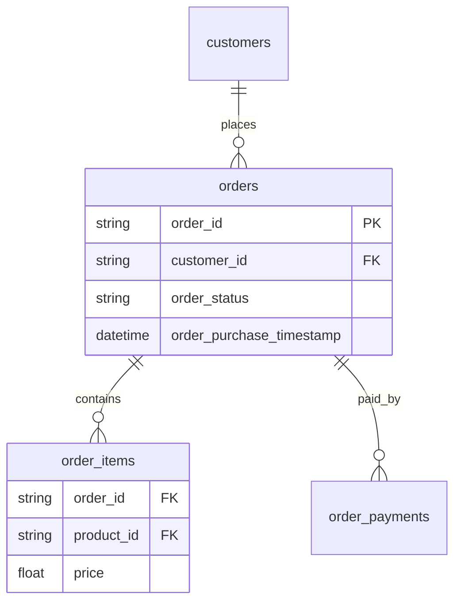

# Product Experimentation & Growth Metrics Platform

**Status:** Phase 1 — Metrics + Simulated Experiment (complete)
**Portfolio:** Project 4 of 5 · Balanced DA/DS strategy

> **Simulated RCT on historical Olist cohorts.** Variants are assigned by hashed
> `customer_unique_id` (seed 42) on historical data — Olist has no native A/B column.
> The treatment effect is a synthetic constant (`SIMULATED_EFFECT = 0.05`, defined once in
> `src/constants.py`) injected after assignment to demonstrate the inference pipeline.
> This is not a real product lift. Seed 42 is documented and pinned.

End-to-end **product analytics** for a classic hiring question: *Did a product change actually improve conversion, or was it noise?* Built on the [Olist Brazilian E-Commerce](https://www.kaggle.com/datasets/olistbr/brazilian-ecommerce) dataset — SQL metric definitions, simulated experiment analysis, confidence intervals, and a ship/no-ship recommendation.

[](https://www.python.org/downloads/)
[](./reports/)
[](../README.md)

> **Disclaimer:** Experiments in this repo are **simulated** on historical Olist data (hashed customer assignment or documented natural experiment). This is not employer A/B test data and does not claim causal lift from a real product rollout.

---

## The business problem

A product team ships a checkout or onboarding change. Leadership asks:

1. Did **conversion** move beyond random noise?
2. Are **AOV** and **repeat purchase** consistent with the story?
3. Was the test **powered** enough to detect a meaningful effect?
4. Should we **ship**, **hold**, or **collect more data**?

Most ML portfolio projects prove modeling depth. This one proves **metric definitions + statistics + product judgment** — the skill cluster that rose fastest in 2026 DS postings (experimentation, causal framing, SQL case studies).

---

## Who this is for (hiring signal)

| Market | Why this repo matters |
|--------|----------------------|
| **Seattle / San Francisco** | Product DS interviews center on A/B design, SQL, and judgment under uncertainty |
| **Vancouver** | Retail funnel analytics (Walmart background) + full-spectrum DA roles |
| **Remote Canada / US** | Demonstrates you can own metrics, not just train models |

**Complements** (does not duplicate): supply chain ML, stock falsification rigor, healthcare interpretability, medallion BI pipeline.

---

## What you will get when complete (v1 target)

| Component | Deliverable | Evidence |
|-----------|-------------|----------|
| **Metric layer** | Versioned SQL in `sql/metrics/` | Conversion, AOV, D7 repeat — each with pytest on fixtures |
| **Experiment** | Simulated RCT or documented natural experiment | Hashed `customer_id` assignment (seed 42) or geo/time split with assumptions labeled |
| **Analysis** | Lift + 95% CI, p-value or bootstrap | `reports/experiment_001.md` auto-generated |
| **Power** | MDE and sample-size reasoning | Section in report or `docs/POWER_ANALYSIS.md` |
| **Dashboard** | Streamlit variant comparison | Control vs treatment with CIs visible |
| **Honesty** | README + report banners | Simulation clearly labeled; null results are valid |

---

## Dataset — Olist Brazilian E-Commerce

**Source:** [Kaggle — Olist](https://www.kaggle.com/datasets/olistbr/brazilian-ecommerce)  
**Local path:** `data/raw/olist/` (9 CSVs onboarded, gitignored)

| File | Role |
|------|------|
| `olist_orders_dataset.csv` | Funnel spine — status, purchase timestamps |
| `olist_order_items_dataset.csv` | Line items, price, freight |
| `olist_order_payments_dataset.csv` | Payment type and value |
| `olist_customers_dataset.csv` | Customer geography |
| `olist_products_dataset.csv` | Product attributes |
| `olist_sellers_dataset.csv` | Seller geography |
| `product_category_name_translation.csv` | English category labels |
| `olist_order_reviews_dataset.csv` | Optional v2 |
| `olist_geolocation_dataset.csv` | Optional v2 |

**Why Olist (not DataCo):** Multi-table relational data supports credible SQL joins, funnels, and cohorts. The supply chain sibling repo taught that single dominant categorical features and tutorial-grade semantics weaken the business story — this project runs an **EDA gate** before any reporting.

### Entity relationship (simplified)



---

## Planned metrics (draft — lock after EDA)

| Metric | Draft definition | Notes |
|--------|------------------|-------|
| **Conversion** | % orders with `order_status == 'delivered'` | Exclude canceled/unavailable explicitly |
| **AOV** | `sum(payment_value) / count(distinct order_id)` | Handle multi-payment rows |
| **D7 repeat** | Customer with ≥2 orders where 2nd within 7 days of 1st | Cohort logic — validate feasibility in EDA |
| **Funnel drop-off** | Created → paid → delivered | By month |
| **Time to deliver** | Delivered − purchase timestamp | If columns reliable |

Every metric will have **SQL in `sql/metrics/`** plus a pytest that runs against a tiny in-memory DuckDB fixture (not the full 100k+ load in CI).

---

## Experiment design (v1 approach)

Olist has **no native A/B column**. The locked v1 approach:

1. Filter a cohort (date range + valid `customer_id`)
2. Assign variant: `hash(customer_id, seed=42) % 2` → control / treatment
3. Compare metrics with lift, 95% CI, and plain-English recommendation

**Portfolio honesty options** (pick one after EDA):

- **Natural experiment** — e.g. payment-type or geo rollout with diff-in-diff assumptions documented
- **Simulated RCT** — hash assignment; may show **null result** (still valuable if power and CIs are correct)
- **Labeled synthetic lift** — methodology demo only; must be marked `SIMULATED_EFFECT` in code constants

See [`CONTEXT.md`](./CONTEXT.md) §6 and [`docs/FUTURE_ENHANCEMENTS.md`](./docs/FUTURE_ENHANCEMENTS.md).

---

## Target architecture (post-EDA)

```
product-experimentation-analytics/
├── src/
│   ├── metrics/          # Python wrappers → sql/
│   ├── experiment/       # assignment, analysis, power
│   ├── report/           # markdown report generator
│   └── io/               # DuckDB loader
├── sql/
│   ├── metrics/          # conversion.sql, aov.sql, d7_repeat.sql
│   └── experiment/       # cohort.sql, variant_assignment.sql
├── tests/fixtures/       # ≤100 rows — no full Olist in unit tests
├── notebooks/            # EDA only
├── reports/              # eda_gate.md, experiment_001.md
├── app/                  # Streamlit (Phase 2)
└── docs/                 # METRICS.md, EXPERIMENT_DESIGN.md
```

**Stack:** Python 3.12+, DuckDB (local SQL), scipy, pytest, Streamlit (v1 dashboard).

**Explicitly out of scope v1:** Airflow, dbt, Snowflake, cloud warehouse — GitHub Actions covers orchestration narrative.

---

## Phase 0 — current focus (START HERE)

Implementation begins only after the EDA gate passes. Do not scaffold full `src/` until GO.

| Deliverable | Status |
|-------------|--------|
| `notebooks/00_eda_gate.ipynb` | ⏳ Pending |
| `reports/eda_gate.md` (GO/NO-GO) | ⏳ Pending |
| `docs/DATA_DICTIONARY.md` | ⏳ Pending |

### EDA gate checks

- Row counts per table; date ranges
- Join integrity: orders ↔ payments ↔ items (% orphans)
- Conversion rate overall and by month
- D7 repeat purchase feasibility
- Covariate balance under hash assignment
- DuckDB conversion query matches pandas

**Pass criteria:** ≥50k valid orders · conversion computable without >5% ambiguous status · metric SQL reproducible.

Full checklist: [`../PORTFOLIO_EDA_SPRINT.md`](../PORTFOLIO_EDA_SPRINT.md)

---

## How this differs from sibling repos

| Repo | Focus |
|------|-------|
| `supply-chain-optimization-ml` | Interpretable ML, leakage control — **not** experimentation |
| `multi-modal-stock-recommender` | Time series, falsification gates — **not** product funnels |
| `healthcare-noshow-predictor` | Regulated health ops, calibration — **not** A/B |
| `medallion-analytics-pipeline` | Lakehouse + Power BI — **not** statistical testing |

---

## Reproduce

```bash
# 1. Install dependencies and pre-commit hooks
make setup

# 2. Place the Olist CSVs in data/raw/olist/
#    Download from https://www.kaggle.com/datasets/olistbr/brazilian-ecommerce
#    Files needed: olist_orders_dataset.csv, olist_order_payments_dataset.csv,
#                  olist_customers_dataset.csv, olist_order_items_dataset.csv

# 3. Run the simulated experiment (bootstrap takes ~10-60 s on ~50k/arm)
make experiment     # writes reports/experiment_001.md

# 4. Run the full test suite (fixtures only — no full Olist in tests)
make test
```

Generated outputs:
- `reports/experiment_001.md` — ship/no-ship recommendation with 95% CI, power table,
  simulation disclaimer

Metric and design documentation:
- [`docs/METRICS.md`](./docs/METRICS.md) — three metric definitions, SQL paths, AOV
  multi-payment rule, person-key rule
- [`docs/EXPERIMENT_DESIGN.md`](./docs/EXPERIMENT_DESIGN.md) — cohort window, assignment,
  injected effect, inference, power/MDE

---

## Developer entry points

1. [`CONTEXT.md`](./CONTEXT.md) — mission, locked decisions, session playbook
2. [`docs/METRICS.md`](./docs/METRICS.md) — metric definitions
3. [`docs/EXPERIMENT_DESIGN.md`](./docs/EXPERIMENT_DESIGN.md) — experiment design
4. [`CLAUDE.md`](./CLAUDE.md) — rules and commands
5. [`../PORTFOLIO_LOCKED_DECISIONS.md`](../PORTFOLIO_LOCKED_DECISIONS.md) — anti-hallucination rules

### Quick setup

```bash
cd product-experimentation-analytics
make setup
make test
make experiment
```

**Data:** Place CSVs in `data/raw/olist/`. If missing, download from [Kaggle](https://www.kaggle.com/datasets/olistbr/brazilian-ecommerce).

---

## Resume bullet (fill after v1 — no invented numbers)

> Defined funnel metrics in SQL on N e-commerce orders (Olist); analyzed simulated A/B test with 95% CIs and power analysis; documented ship/no-ship recommendation.

---

## Author

**Tirth Joshi** — UBC Master of Data Science · Former analytics (VGH, BCCNM, Walmart Canada)

Do **not** claim Olist or simulated experiments as employer work.

---

## License

MIT License. See [`LICENSE`](LICENSE) when added.
