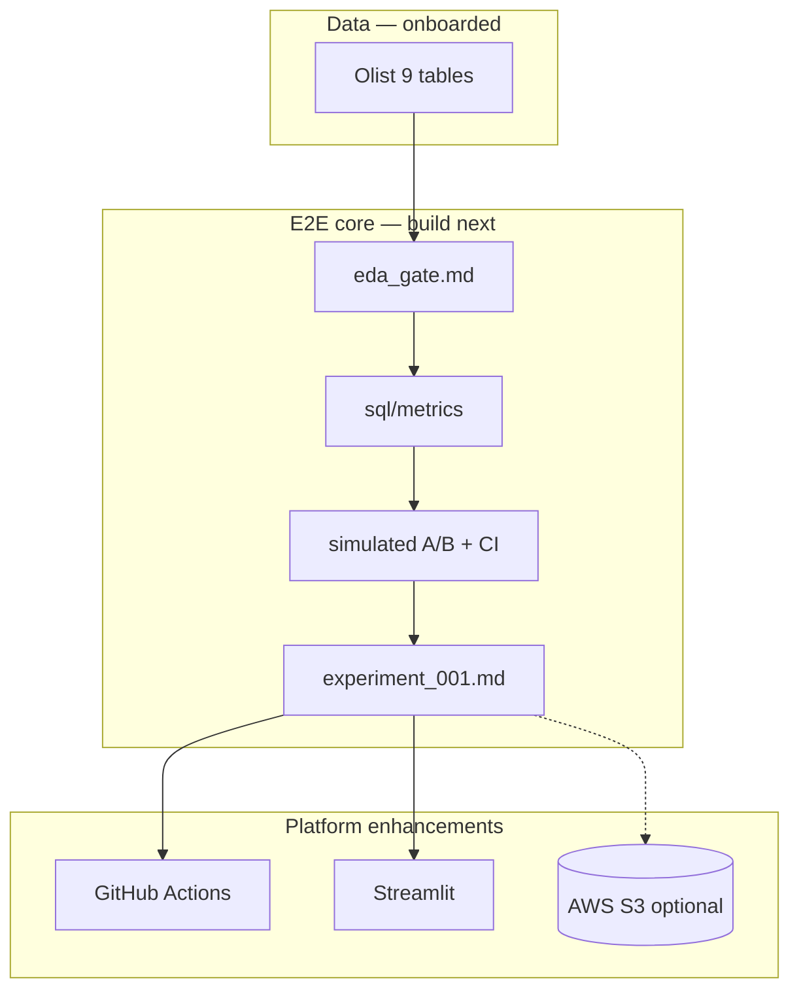

# Future Enhancements — Product Experimentation Analytics

**Repo:** `product-experimentation-analytics`  
**Updated:** 2026-05-30  

**Dataset:** Olist Brazilian E-Commerce (`data/raw/olist/` — 9 CSVs onboarded)

---

## E2E definition (complete story)

Done when:

- [ ] `reports/eda_gate.md` — GO
- [ ] `sql/metrics/` — conversion, AOV, D7 repeat + pytest
- [ ] Simulated A/B with lift + 95% CI → `reports/experiment_001.md`
- [ ] `docs/METRICS.md` + `docs/EXPERIMENT_DESIGN.md` (simulation labeled honestly)
- [ ] Streamlit or static HTML report
- [ ] README with reproduction steps

---

## Apply-ready enhancements

| Priority | Enhancement | Tool | Employer signal |
|----------|-------------|------|-----------------|
| P0 | EDA gate notebook + `eda_gate.md` | DuckDB/pandas | Data quality |
| P0 | Metric SQL layer + tests | DuckDB + pytest | SQL depth (Seattle/SF/Vancouver DA) |
| P0 | Simulated RCT + power analysis | scipy/bootstrap | Product DS |
| P1 | GitHub Action regenerates experiment report | GitHub Actions | Orchestration (Airflow narrative) |
| P1 | Streamlit variant comparison dashboard | Streamlit | Demo |

---

## Optional layers (after E2E)

| Enhancement | Tool | Notes |
|-------------|------|-------|
| S3 publish `experiment_001.md` PDF | AWS S3 | Optional artifact archive |
| Diff-in-diff on natural experiment | statsmodels | If EDA finds valid geo/time split |
| dbt-core on DuckDB | dbt | Nice-to-have; DuckDB SQL sufficient for portfolio |
| Databricks / Snowflake | — | **Skip** — local-first by design |
| Docker | — | **Skip** unless CI reproducibility needs it |
| Airflow | — | **Skip** — GitHub Actions enough |

---

## Explicitly rejected

| Item | Why |
|------|-----|
| Azure-only pipeline repo | Document Azure equivalence in medallion instead |
| Real Olist A/B column invention | Must label simulated assignment |
| EC2 | No always-on server needed |

---

## Architecture target

