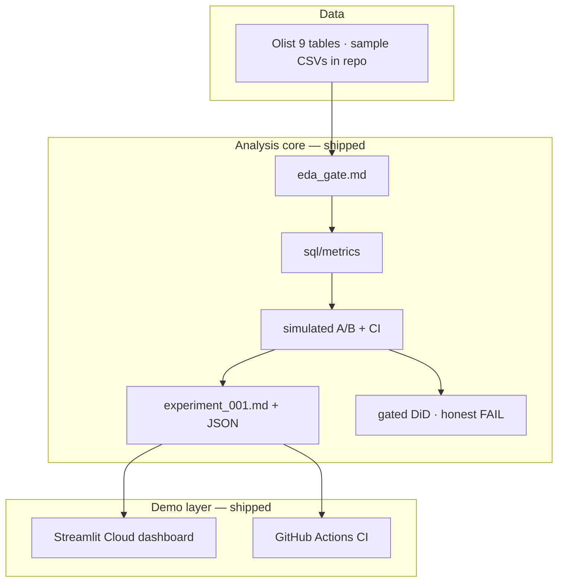

# Future Enhancements — Product Experimentation Analytics

**Repo:** `product-experimentation-analytics`  
**Updated:** 2026-07-15  
**Status:** v1 shipped — live dashboard, committed reports, 208 tests, CI green.

---

## v1 delivered (complete)

- [x] `reports/eda_gate.md` — GO
- [x] `sql/metrics/` — conversion, AOV, D7 repeat + pytest
- [x] Simulated A/B with lift + 95% CI → `reports/experiment_001.md`
- [x] `docs/METRICS.md` + `docs/EXPERIMENT_DESIGN.md` (simulation labeled honestly)
- [x] 5-tab Streamlit dashboard on [Streamlit Cloud](https://product-experimentation-analytics.streamlit.app/)
- [x] README with reproduction steps and live demo link
- [x] Gated DiD natural experiment — honest rejection documented (ADR 0009)

---

## Optional v2 (not started)

| Enhancement | Tool | Notes |
|-------------|------|-------|
| GitHub Action regenerates experiment report on schedule | GitHub Actions | Orchestration narrative; keep committed JSON as source of truth |
| DiD on denser geography or volume outcome | statsmodels | Only after a new event passes the pre-registered gate |
| S3 publish `experiment_001.md` PDF | AWS S3 | Optional artifact archive |
| dbt-core on DuckDB | dbt | Nice-to-have; versioned SQL in `sql/` is sufficient for v1 |

---

## Explicitly out of scope

| Item | Why |
|------|-----|
| Azure-only pipeline repo | Document Azure equivalence in medallion instead |
| Inventing a real Olist A/B column | Must label simulated assignment |
| EC2 / always-on compute | Streamlit Cloud + local `make` suffice |
| dbt / Snowflake / Databricks as v1 requirement | Local-first DuckDB by design |
| Docker | Skip unless CI reproducibility needs it |

---

## Architecture (as built)

